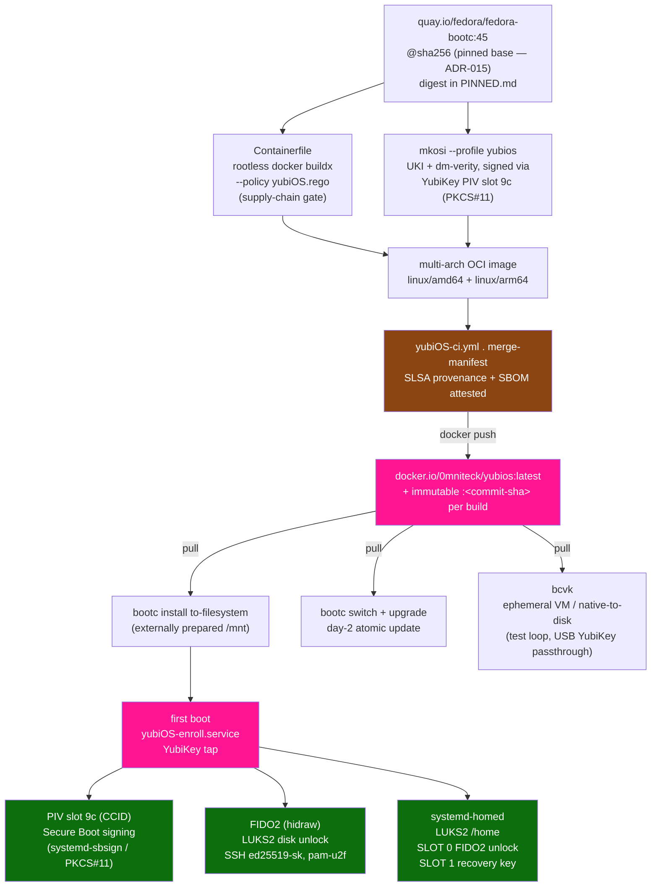

<div align="center">


# yubiOS

**FIDO2-first immutable OS — HSM/U2F as the root of trust**

[](LICENSE)
[](TODO.md)
[](https://www.yubico.com)
[](https://fidoalliance.org)

*No OEM. No trust anchors you don't control.*
### 🦴 🚧 Work In Progress 🚧 Work In Progress 🚧 Work In Progress 🚧

</div>

---

## What it is

yubiOS is an immutable, bootc-delivered Linux OS that treats the owner's YubiKey as the user-facing identity, unlock, and authorization boundary. It combines:

| Layer | Inspiration | What it gives us |
|---|---|---|
| particleos ethos | [systemd/particleos](https://github.com/systemd/particleos) | Immutable `/usr`, UKIs, dm-verity, composefs, systemd-boot |
| bootc design | [bootc-dev/bootc](https://github.com/bootc-dev/bootc) | OCI image as OS delivery unit, day-2 upgrades via registry pull |
| systemd image model | [Fitting Everything Together](https://0pointer.net/blog/fitting-everything-together.html) | DPS partitions, systemd-repart first boot, A/B sysupdate, systemd-homed |
| YubiKey owner-control plane | FIDO2 / PIV / OATH | Owner-held authorization for signing, unlock, SSH, PAM, and app 2FA |

ARM64 is the primary target platform because it is where yubiOS can work toward owning the firmware stack below the UKI through TF-A, OP-TEE, fTPM, and U-Boot. x86-64 remains fully supported above the UKI, but its firmware and optional TPM are platform/OEM trust anchors.

### Ecosystem alignment

In January 2026 the core systemd team and the engineers behind, composefs, runc, Flatcar,
ParticleOS, and Ubuntu Core — founded [Amutable](https://amutable.com) with the mission:

> *“Deliver determinism and verifiable integrity to Linux workloads everywhere.”*

yubiOS is independently building toward the same architecture, with one additional constraint:
the owner-facing authority should live with the machine owner. A YubiKey provides the signing,
unlock, SSH, PAM, and application-2FA boundary, while TPM/fTPM measurement and firmware
state remain separate platform-integrity signals where they are useful. The "Fitting Everything
Together" essay at [0pointer.net](https://0pointer.net/blog/fitting-everything-together.html) is the
primary design reference for yubiOS — hermetic /usr, DPS partitions, systemd-repart first-boot,
A/B sysupdate, systemd-homed per-user encryption, and UKI + dm-verity trust chain.

## Trust chain

```text
YubiKey 5
- PIV slot 9c via CCID: Secure Boot / UKI signing with systemd-sbsign + PKCS#11
- FIDO2 hmac-secret via hidraw: LUKS2 root and systemd-homed unlock
- FIDO2 ed25519-sk via hidraw: SSH resident keys
- FIDO2 U2F via hidraw: sudo/login with pam-u2f
- OATH via hidraw: application 2FA
```

Secure Boot signing uses PIV/CCID, not hidraw. Full rationale: [ADR-002](ADR.md#adr-002-secure-boot-signing-via-piv-ccid-not-fido2-hidraw).

## Get yubiOS

yubiOS currently publishes a pre-launch multi-arch [bootc](https://github.com/bootc-dev/bootc) OCI image on Docker Hub:

```sh
docker pull 0mniteck/yubios:latest
```

For reproducible installs, pin the image by the digest produced by the latest green `yubiOS-ci.yml` publish for the intended release. Do not treat a run-specific digest in an old PR or research note as evergreen.

> **Warning:** yubiOS is groundwork / work in progress. The install flows below can destroy data on the target disk. Test on disposable hardware or a VM, back up recovery material first, and use the current [TODO.md](TODO.md), [BLOCKERS.md](BLOCKERS.md), and [PR.md](PR.md) before treating any image as safe for broader use.

Prepare and mount the target filesystems first, for example with `systemd-repart` or another installer that creates the yubiOS DPS layout. Mount the target root at `/mnt` and its boot filesystem at `/mnt/boot`, then install the image with `bootc install to-filesystem`:

## Build from source, install to-filesystem, 1 step

```sh
docker buildx build --load --policy reset=true,strict=true,filename=yubiOS.rego -t yubios:local . && \
docker run --rm --privileged --pid=host --ipc=host \
  --security-opt label=type:unconfined_t \
  -v /dev:/dev \
  -v /var/lib/containers:/var/lib/containers \
  -v /:/run/host \
  yubios:local bootc install to-filesystem \
    --bootloader=systemd \
    --root-mount-spec="" \
    --composefs-backend \
    --skip-finalize \
    /run/host/mnt/
```

## Fetch/install from the OCI image, 1 step

```sh
IMAGE=docker.io/0mniteck/yubios:latest
docker pull "$IMAGE" && \
docker run --rm --privileged --pid=host --ipc=host \
  --security-opt label=type:unconfined_t \
  -v /var/lib/containers:/var/lib/containers \
  -v /dev:/dev \
  -v /:/run/host \
  "$IMAGE" \
  bootc install to-filesystem \
    --source-imgref="registry:${IMAGE}" \
    --bootloader=systemd \
    --root-mount-spec="" \
    --composefs-backend \
    --skip-finalize \
    /run/host/mnt/

bootc switch 0mniteck/yubios:latest
bootc upgrade
```

Every approved base image and GitHub Action SHA lives in [PINNED.md](PINNED.md). That file is the single source of truth for pins.

| Registry | `docker.io/0mniteck/yubios` |
|---|---|
| Production tags | `latest` plus immutable commit tags |
| Test tags | `dev`, `dev-<sha>` for swu2f TEST-only images |
| Artifact tags | `installer`, `firmware` and per-commit variants |
| Platforms | `linux/amd64`, `linux/arm64` |
| Supply chain | SLSA build provenance + SBOM attestations |

## Enrollment wizard

On first boot `yubiOS-enroll.service` runs on tty1 and walks through:

1. Secure Boot signing through PIV slot 9c.
2. Disk encryption through FIDO2 hmac-secret.
3. SSH resident key generation through `ed25519-sk`.
4. sudo/login registration through pam-u2f.

Each step is skippable and independently re-runnable. See [ONBOARDING.md](ONBOARDING.md).

## Repo layout

```text
yubiOS/
├── .github/workflows/              # CI, manifest refresh, publish, VM/e2e, integration lanes
├── assets/                         # logo and release/documentation assets
├── mkosi.conf                      # primary mkosi build definition
├── mkosi.conf.d/                   # desktop, minimal, Surface, Chipsec, and test profiles
├── refs/                           # dated research notes, planning cycles, implementation specs
├── tests/                          # unit, VM, PKCS#11, FIDO2, UKI, and policy verification tests
├── usr/lib/                        # OS overlay: bootc, dracut, PAM, repart, systemd, yubiOS scripts
├── Containerfile                   # production bootc image definition
├── Containerfile.dev               # TEST-only swu2f/dev image definition
├── yubiOS.rego                     # Docker Build Policy gate for pins and registries
├── renovate.json                   # pinned digest tracking automation
├── AGENTS.md                       # repository guidance for coding agents
├── README.md                       # project overview, install, and source map
├── ADR.md                          # architecture decision records
├── ARCHITECTURE.md                 # trust chain and build pipeline diagrams
├── SPEC.md                         # normative project specification
├── MISSION.md                      # project mission and AI-resilience framing
├── MITIGATE.md                     # threat model and control mapping
├── FUTURE.md                       # roadmap and research backlog
├── ONBOARDING.md                   # operator enrollment guide
├── CITATION.md                     # citation guidance and upstream source trail
├── PR.md                           # public-relations campaign planning
├── PINNED.md                       # approved refs and digests
├── BLOCKERS.md                     # active dependency and blocker map
└── TODO.md                         # active planning surface
```

## Requirements

| Component | Minimum |
|---|---|
| YubiKey firmware | 5.2.3 for ed25519-sk |
| systemd | 261 for current measured-boot gates and v261 research targets |
| OpenSSH | 8.2 for FIDO2 key types |
| pam-u2f | 1.3.1 for CVE-2025-23013 fix |
| Platform | arm64/aarch64 primary; x86-64 secondary but fully supported |



## Current research notes

- Latest docs/research planning pass: [refs/planning-cycle-2026-07-11.md](refs/planning-cycle-2026-07-11.md)
- Public-relations campaign: [PR.md](PR.md), with kickoff friend map at [refs/pr-friend-map-2026-07-17.md](refs/pr-friend-map-2026-07-17.md)
- ARM64 zstd EFI zboot / bcvk DirectBoot: [refs/zstd-efi-zboot-bcvk.md](refs/zstd-efi-zboot-bcvk.md)
- LUKS2 FIDO2 e2e coverage: [refs/luks-fido2-e2e-test.md](refs/luks-fido2-e2e-test.md)
- ARM64 fTPM Phase F0: [refs/arm64-ftpm-phase-f0.md](refs/arm64-ftpm-phase-f0.md)
- systemd v261 base-image history: [refs/v261-base-image.md](refs/v261-base-image.md)

All decisions are recorded in [ADR.md](ADR.md), with source-backed research in [refs/](refs/).
