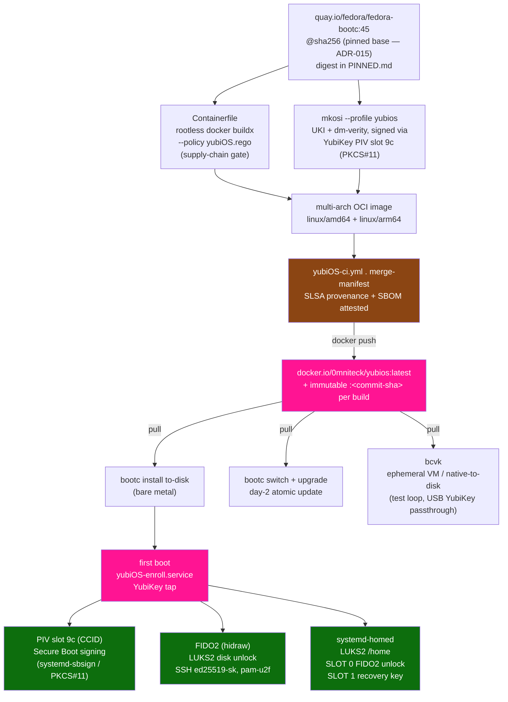

<div align="center">


# yubiOS

**FIDO2-first immutable OS — YubiKey is the root of trust**

### 🦴 🚧 Work In Progress 🚧 Work In Progress 🚧 Work In Progress 🚧

[](LICENSE)
[](TODO.md)
[](https://www.yubico.com)
[](https://fidoalliance.org)

*No TPM. No OEM. No trust anchors you don't control.*

</div>

---

## What it is

yubiOS fuses four lineages:

| Layer | Inspiration | What it gives us |
|---|---|---|
| **particleos ethos** | [systemd/particleos](https://github.com/systemd/particleos) | Immutable rootfs, UKI, dm-verity, composefs, systemd-boot |
| **bootc design** | [bootc-dev/bootc](https://github.com/bootc-dev/bootc) | OCI image as OS delivery unit, day-2 upgrades via registry pull |
| **Amutable vision** | [Lennart Poettering + systemd team](https://amutable.com) | "Integrity should be built into every critical infrastructure project" — image-based OS, verifiable integrity, determinism as a default |
| **YubiKey root of trust** | FIDO2 / PIV / OATH | Hardware-bound trust replacing TPM at every boundary |

### Ecosystem alignment

In January 2026 the core systemd team and the engineers behind, composefs, runc, Flatcar,
ParticleOS, and Ubuntu Core — founded [Amutable](https://amutable.com) with the mission:

> *“Deliver determinism and verifiable integrity to Linux workloads everywhere.”*

yubiOS is independently building toward the same architecture, with one additional constraint:
the YubiKey replaces the TPM as the hardware root of trust at every layer. The "Fitting Everything
Together" essay at [0pointer.net](https://0pointer.net/blog/fitting-everything-together.html) is the
primary design reference for yubiOS — hermetic /usr, DPS partitions, systemd-repart first-boot,
A/B sysupdate, systemd-homed per-user encryption, and UKI + dm-verity trust chain.

## Trust chain

```
┌───────────────────────────────────────────┐
│                 YubiKey 5                 │
├───────────────────────────────────────────┤
│ PIV slot 9c (CCID)   Secure Boot signing  │
│ FIDO2 HMAC-secret    Disk unlock (hidraw) │
│ FIDO2 ed25519-sk     SSH keys    (hidraw) │
│ FIDO2 U2F            sudo/login  (hidraw) │
│ OATH TOTP            App 2FA     (hidraw) │
└───────────────────────────────────────────┘
```

> **ADR-002 note:** Secure Boot signing uses PIV/CCID (via `systemd-sbsign` + PKCS#11),
> not hidraw. All other operations run on FIDO2 via `/dev/hidraw*`. Full rationale: [ADR.md](ADR.md)

## Get yubiOS

yubiOS ships as a **multi-arch [bootc](https://github.com/bootc-dev/bootc) OCI image on Docker Hub** — this is the primary download.

**Pull** (auto-selects `amd64` / `arm64`):
```sh
docker pull 0mniteck/yubios:latest
```

**Pin by digest** (reproducible — recommended for installs):
```sh
docker pull 0mniteck/yubios@sha256:c965a816b9173cf6f227e6b5b09e321e841ab5f8a49075c112657a0a40b5e761
```

**Install / upgrade with bootc:**
```sh
sudo bootc install to-disk --source-imgref docker://0mniteck/yubios:latest /dev/nvme0n1
sudo bootc switch 0mniteck/yubios:latest && sudo bootc upgrade
```

| | |
|---|---|
| Registry | `docker.io/0mniteck/yubios` |
| Tags | `:latest` + immutable `:<commit-sha>` per build |
| Platforms | `linux/amd64`, `linux/arm64` |
| Supply chain | SLSA build provenance + SBOM attestations attached |
| Published by | `yubiOS-ci.yml` `merge-manifest` job (current: run #113, `bfbc38f`) |

> Building from source instead? See **Quick start** below.

## Quick start

```sh
# Build the OCI image (per ADR-014: Docker Buildx, not Podman)
docker buildx build --policy reset=true,strict=true,filename=yubiOS.rego -t yubiOS .

# Install to disk (disable Secure Boot in UEFI first)
docker run --rm --privileged --pid=host \
  -v /dev:/dev -v /var/lib/containers:/var/lib/containers \
  yubiOS bootc install to-disk /dev/nvme0n1

# First boot: the enrollment wizard runs automatically
# Or launch it manually:
yubiOS-enroll
```

## Enrollment wizard

On first boot `yubiOS-enroll.service` fires on tty1 and walks through:

```
 ─── Step 1/4: Secure Boot Signing ───
 ─── Step 2/4: Disk Encryption (FIDO2 hidraw) ───
 ─── Step 3/4: SSH Key (ed25519-sk resident) ───
 ─── Step 4/4: sudo / Login Auth (U2F pam-u2f) ───
```

Each step is skippable. Each script is independently re-runnable. See [ONBOARDING.md](ONBOARDING.md).

## Repo layout

```
yubiOS/
├── .github/workflows/           # CI: main build, ARM64 fTPM integration lanes, dhi manifest fetch
│   ├── yubiOS-ci.yml               # primary build+test+publish pipeline (merge-manifest -> Docker Hub)
│   ├── ci_test-vm.yml              # bcvk VM test suite (swtpm, swu2f)
│   ├── ci_test-int.yml             # ARM64 secure-world integration orchestrator
│   ├── ci_int_stmm.yml             # StandaloneMM (F1) lane
│   ├── ci_int_optee_fip.yml        # OP-TEE + TF-A FIP fold (F2) lane
│   ├── ci_int_qemu.yml             # QEMU e2e (F4) lane
│   └── fetch-dhi-manifest.yml      # resolves dhi.io/debian-base INDEX digest
├── assets/
│   ├── logo.png                    # you're looking at it
│   └── ci/vm-swtpm.conf            # swtpm drop-in for bcvk CI VMs
├── mkosi.conf                   # mkosi build (particleos-style UKI + verity)
├── mkosi.conf.d/
│   ├── desktop/mkosi.conf          # GNOME desktop profile
│   ├── minimal/mkosi.conf          # minimal profile
│   ├── surface-x86/mkosi.conf      # Surface x86 profile
│   ├── surface-arm64/mkosi.conf    # Surface ARM64 profile
│   └── test/                       # TEST-only profile: swu2f in-guest CTAP2 authenticator
│       ├── mkosi.conf
│       └── install-swu2f-authenticator.sh
├── Containerfile                # OCI image (bootc, Fedora base)
├── yubiOS.rego                  # OPA/Rego supply-chain Build Policy
├── renovate.json                # digest-tracking automation (ADR-015)
├── refs/                        # per-PR test/implementation specs
│   ├── v261-base-image.md
│   ├── sbsign-pkcs11-validate.md
│   ├── luks-fido2-e2e-test.md
│   ├── bcvk-swtpm-ci.md
│   └── arm64-ftpm-phase-f0.md
├── tests/
│   ├── unit/                       # bats unit tests (enroll-*, pam-u2f stack, lib)
│   ├── fixtures/                   # lsblk fixtures for LUKS detection tests
│   ├── vm/                         # bcvk VM test scripts (LUKS2 e2e, TPM PCR verify, ARM64 fTPM QEMU)
│   ├── validate-pkcs11-uri.sh       # PKCS#11 URI validation for PIV slot 9c
│   └── verify-uki-signature.sh      # UKI signature verification
├── usr/lib/
│   ├── bootc/install/               # bootc install config (systemd-boot, DPS)
│   ├── bootc/kargs.d/               # persistent kernel args
│   ├── dracut.conf.d/               # fido2 + composefs dracut modules for boot-time unlock
│   ├── udev/rules.d/                # YubiKey hidraw + CCID uaccess rules
│   ├── pam.d/                       # PAM U2F sudo + system-auth config
│   ├── repart/                      # systemd-repart first-boot partition definitions
│   ├── systemd/system/              # enrollment service unit
│   ├── systemd/system-preset/       # enrollment service preset
│   ├── systemd/homed.conf.d/        # homed FIDO2 defaults
│   └── yubiOS/                      # enrollment scripts (sb, luks, homed, ssh, pam, totp, gpg, largeblob, backup) + lib.sh
├── ADR.md                       # architecture decision records
├── ARCHITECTURE.md              # trust chain + build pipeline diagrams
├── SPEC.md                      # consolidated architecture + use-case specification
├── MISSION.md                   # project mission
├── MITIGATE.md                  # attack-surface -> control mapping (Faux Phy threat model)
├── FUTURE.md                    # post-launch ARM64-owned root of trust plan
├── ONBOARDING.md                 # step-by-step onboarding guide
├── PINNED.md                     # single source of truth for pinned digests/SHAs
├── BLOCKERS.md                   # open issue dependency map
├── TODO.md                       # known gaps + future work
├── AGENTS.md                     # guidance for AI coding agents working on this org
├── MAINTAINER.md                 # maintainer contact
└── CITATION.md                   # citation + primary-source references
```

## Requirements

| | Minimum |
|---|---|
| YubiKey firmware | 5.2.3 (ed25519-sk) |
| systemd | **261** (systemd-sbsign, systemd-cryptenroll FIDO2; v261 adds `ConditionSecurity=measured-os`, `RestrictFileSystems=`) |
| OpenSSH | 8.2 (FIDO2 key types) |
| pam-u2f | **1.3.1** (CVE-2025-23013 fix) |
| Platform | **x86-64** (primary); **arm64/aarch64** (in development — see ADR-017) |

## Design decisions



All decisions are recorded in [ADR.md](ADR.md) with sources.
The short version: TPM replaced by YubiKey everywhere it can be.
